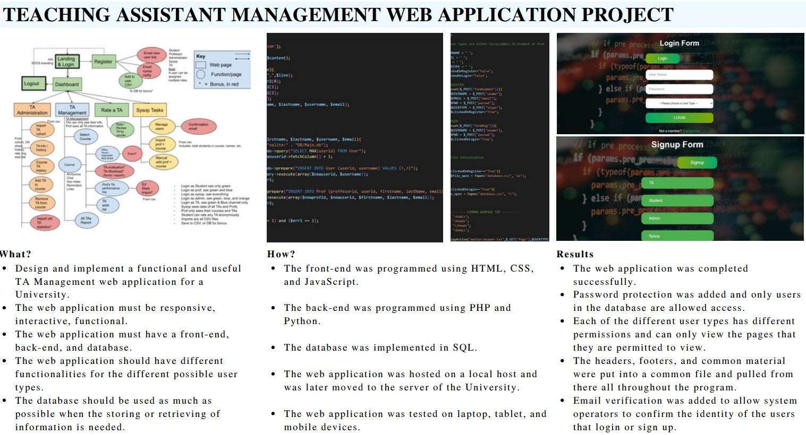
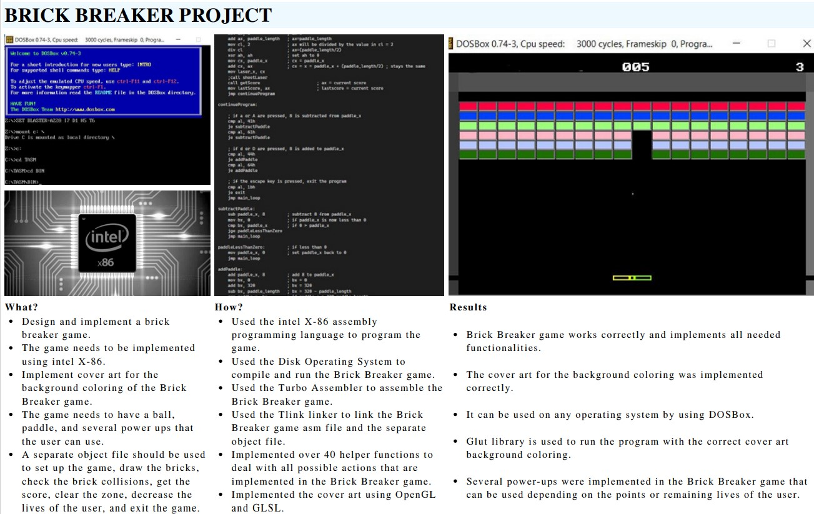
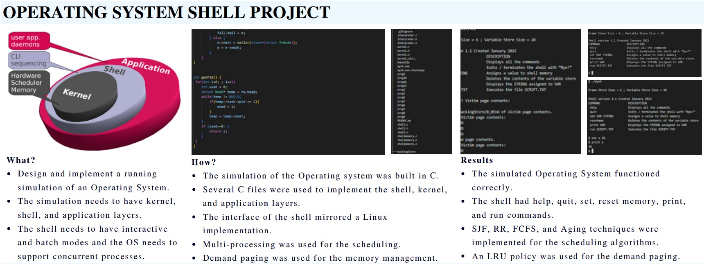
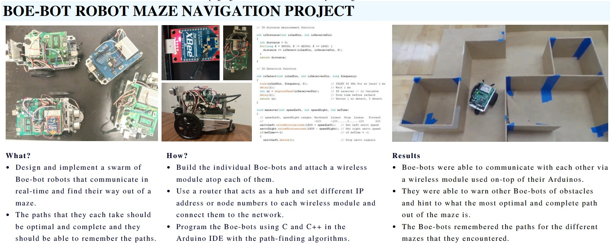
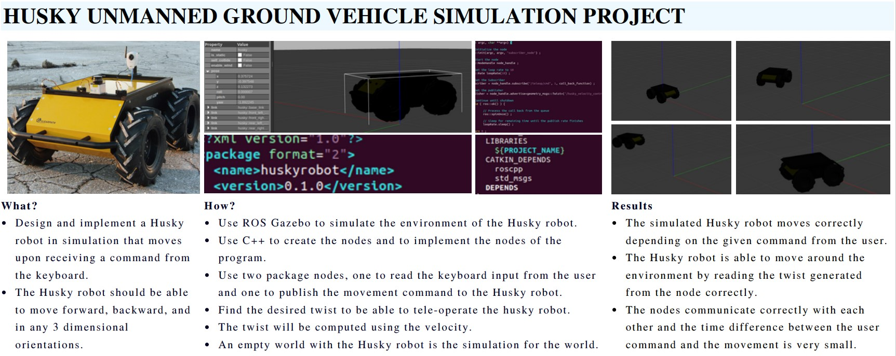
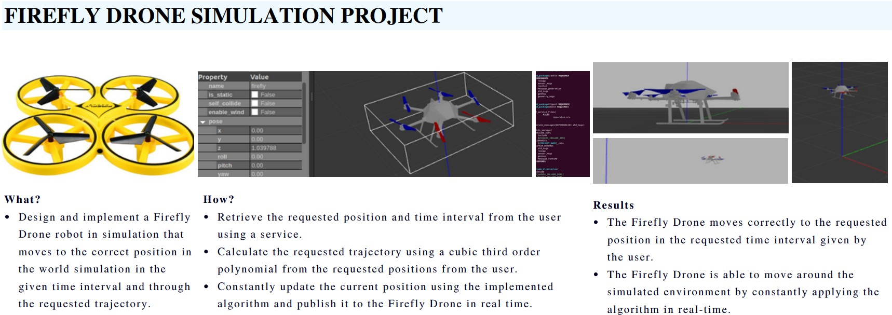
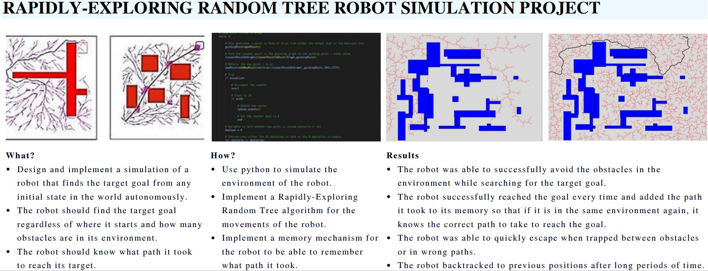

<!-- pages/projects.md -->
<!-- 
 -->
<!-- 

  <!-- Display categorized projects -->
  <!--  -->
  <!-- <h2 class="category">{{ category }}</h2> -->
  <!--  -->
  <!--  --> -->

  
      
    
      
    
      
    
      
    
      
    
      
    
      
    
      
    
      
    
      

  <!-- Generate cards for each project -->
  <!-- 
  

    

    
      
    
    

  

  
  

    
      
    
  

  
   -->

<!-- 

<!-- Display projects without categories -->
  <!-- 
  <!-- Generate cards for each project -->
  <!-- 
  

    

    
      
    
    

  

  
  

    
      
    
  

   -->
<!--  -->
<!-- 
 -->